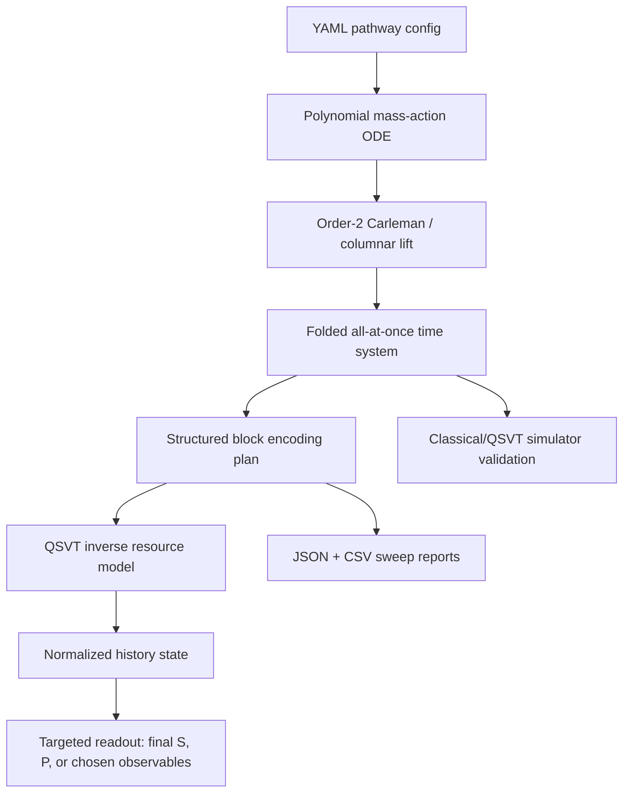
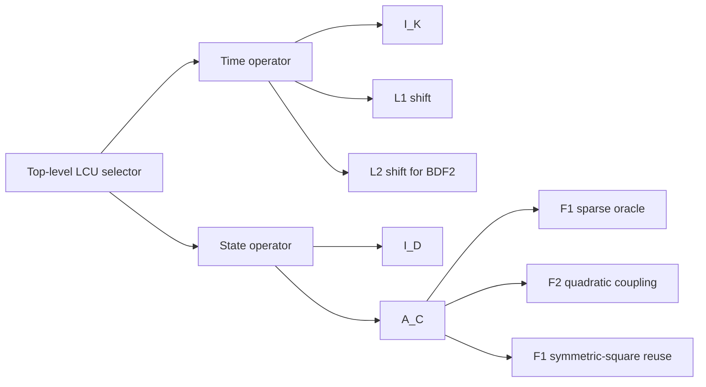
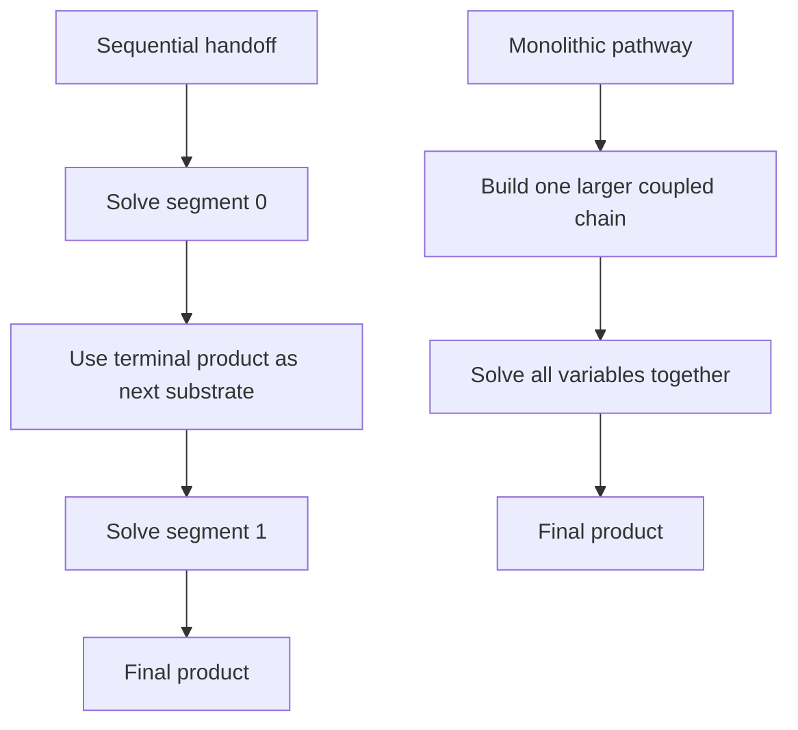

# Scalable pathway solver walkthrough

This guide explains the current Enzyme QLS hardware-oriented pathway solver:
what biological pathway it models, how the equations are lifted, why folded
Euler is used, how QSVT enters, what the resource reports mean, and how to run
the available scripts and interactive tools.

The implementation is not a claim that a large metabolic pathway is already
running on quantum hardware. It is a reproducible scaffold for:

- building variable-length enzyme pathway ODEs;
- lifting them with order-2 Carleman linearization;
- folding all time steps into one sparse linear system;
- estimating QSVT/block-encoding/readout resources;
- comparing monolithic chained pathways with sequential product handoff;
- recording provenance for each design choice and generated report.

## System Overview

The one-segment pathway is:

```text
S -> X1 -> X2 -> ... -> Xm -> P
```

where `m` is the number of intermediates. Each arrow is modeled as one enzyme
reaction with a free metabolite and one enzyme-substrate complex. Therefore:

```text
reactions r = m + 1
physical variables n = metabolites + complexes = (m + 2) + (m + 1) = 2m + 3
```

The four-reaction notebook model is the `m = 3` case:

```text
S -> X1 -> X2 -> X3 -> P
```

with variables:

```text
S, X1, X2, X3, P, C1, C2, C3, C4
```

## Visual Pipeline



The core idea is to avoid measuring every intermediate time step. Instead, the
folded system prepares the whole time history in one QLS/QSVT solve:

$$
|Y\rangle \propto \sum_{k=1}^{K}|k\rangle|y_k\rangle.
$$

Only the scientifically needed observables are then read out.

## Mass-action ODE

Each reaction consumes one substrate-like metabolite and produces the next
metabolite through an enzyme complex. For one reaction $i$:

$$
S_i + E_i \rightleftharpoons C_i \rightarrow S_{i+1} + E_i.
$$

The implemented reduced mass-action form uses an enzyme total parameter and
keeps one complex variable $C_i$. The vector field is quadratic because complex
formation includes products like:

$$
S_i C_i.
$$

The polynomial ODE has the form:

$$
\dot{x}=f(x),
$$

where $x\in\mathbb{R}^{n}$ is the vector of metabolites and complexes. For this
pathway family, the degree is at most 2:

$$
\dot{x}=F_1x+F_2(x\otimes_s x).
$$

Here $x\otimes_s x$ means the symmetric degree-2 monomial basis:

```text
x1*x1, x1*x2, ..., x1*xn, x2*x2, ..., xn*xn
```

## Order-2 Carleman Lift

Carleman linearization embeds nonlinear monomials into a larger linear system.
With truncation order 2, the lifted state is:

$$
y=
\begin{bmatrix}
x \\
x\otimes_s x
\end{bmatrix}.
$$

The lifted dimension is:

$$
D=n+\frac{n(n+1)}{2}=\frac{n(n+3)}{2}.
$$

Since $n=2m+3$ for one segment:

$$
D=\frac{(2m+3)(2m+6)}{2}.
$$

The order-2 lifted matrix has the block form:

$$
A_C=
\begin{bmatrix}
F_1 & F_2 \\
0 & F_1\oplus_s F_1
\end{bmatrix}.
$$

Important properties currently checked by tests and reports:

- the lower-left block is zero;
- $F_2$ is sparse and reaction-local;
- $F_1\oplus_s F_1$ is induced from $F_1$, not loaded as unrelated dense data;
- row sparsity stays small for local chain pathways.

## Folded Euler System

The default folded integrator is folded backward Euler. For the linear lifted
system:

$$
\dot{y}=A_Cy,
$$

ordinary backward Euler gives:

$$
(I-hA_C)y_{k+1}=y_k.
$$

Running this step-by-step on quantum hardware is a poor interface because each
step would require preparing a new right-hand side. The folded system stacks all
unknowns:

$$
Y=
\begin{bmatrix}
y_1\\
y_2\\
\vdots\\
y_K
\end{bmatrix}.
$$

Then one sparse all-at-once system is solved:

$$
M_{BE}Y=b,
$$

where:

$$
M_{BE}=I_K\otimes(I-hA_C)-L_1\otimes I_D.
$$

$L_1$ is the first subdiagonal time-shift matrix. The right-hand side contains
the initial lifted state in the first block:

$$
b=
\begin{bmatrix}
y_0\\
0\\
\vdots\\
0
\end{bmatrix}.
$$

Implemented comparison folded methods:

- folded backward Euler: 3 Kronecker/LCU terms;
- folded Crank-Nicolson: 4 Kronecker/LCU terms;
- folded BDF2: 5 Kronecker/LCU terms.

## QSVT Role

QSVT is the intended quantum linear solver. The current implementation has two
layers:

- simulator validation: dense/SVD/Chebyshev reciprocal polynomial;
- hardware resource model: block-encoding/query/oracle/readout estimates.

For a block encoding of $M/\alpha$, reciprocal QSVT approximates:

$$
x\mapsto \frac{1}{x}
$$

on the singular-value interval of the normalized matrix. The report uses this
query proxy:

$$
Q_{\mathrm{QSVT}}\approx \alpha\kappa\log(1/\epsilon),
$$

where:

- $\alpha$ is the block-encoding normalization bound;
- $\kappa$ is the folded-system condition estimate;
- $\epsilon$ is the requested QSVT precision proxy.

This is not a wall-clock runtime. State preparation, oracle compilation, QSVT
phase synthesis, and readout still matter.

## Structured Block Encoding

The folded matrix is not treated as a dense matrix. It has structure:



The JSON report includes `structured_block_encoding_estimate`, which records:

- time register qubits;
- lifted-state register qubits;
- degree register qubits;
- symmetric-pair register qubits;
- reaction-index qubits;
- top-level LCU selector qubits;
- sparse row-degree bound;
- unique coefficient count;
- intended component oracle names.

The report also includes `oracle_gate_proxy_estimate`, a coarse Toffoli-like
proxy for one block-encoding query. It estimates work from:

- time-shift arithmetic;
- symmetric pair rank/unrank;
- reaction decoding;
- sparse row emission;
- coefficient lookup;
- selector controls.

It excludes routing, fault-tolerant synthesis, magic-state factory overhead,
QSVT phase synthesis, state preparation, and readout.

## Chained Pathways

The project supports product-to-next-substrate chains, for example:

```text
Segment A: S -> X1 -> P_A
Segment B: P_A -> Y1 -> Y2 -> P_B
```

There are two analysis modes:



The report includes:

- `monolithic_vs_sequential`: matrix-size and resource comparison;
- `dynamic_handoff_reference`: exact classical ODE comparison of terminal product
  under segment-by-segment handoff versus monolithic dynamics.

The two final products usually differ because sequential handoff assumes the
previous segment has finished before the next segment evolves, while monolithic
dynamics evolve the whole chain simultaneously.

## Readout

The folded QSVT solve prepares a normalized history state:

$$
|Y\rangle=\frac{1}{\|Y\|}\sum_{k=1}^{K}\sum_{j=1}^{D}y_{k,j}|k,j\rangle.
$$

Measuring in the computational basis gives:

$$
p_{k,j}=\frac{|y_{k,j}|^2}{\|Y\|^2}.
$$

That loses sign/phase and the solution norm. Therefore the hardware-facing
readout model targets signed amplitudes or linear observables with interference
tests, not full-vector tomography.

The report includes:

- final-time postselection probability;
- amplitude-amplification query proxy;
- Hadamard-test shot proxy;
- amplitude-estimation query proxy;
- terminal-padding proxy.

Terminal padding appends coherent copies of the final-time state:

$$
z_1=y_K,\qquad z_{j+1}=z_j.
$$

This increases final-time acceptance probability without evolving beyond the
requested horizon.

## What Can Be Run

### 1. Fast pathway sweep

```bash
python scripts/analyze_hardware_path.py \
  --intermediate-min 0 \
  --intermediate-max 10 \
  --output outputs/hardware_path/pathway_sweep.json \
  --summary-csv outputs/hardware_path/pathway_sweep.csv
```

Outputs:

- `outputs/hardware_path/pathway_sweep.json`
- `outputs/hardware_path/pathway_sweep_intermediates.csv`
- `outputs/hardware_path/pathway_sweep_chained.csv`

Use this to compare how matrix sizes, sparsity, folded dimensions, and oracle
proxy costs change as the number of intermediates grows.

### 2. Condition and equilibration sweep

```bash
python scripts/analyze_hardware_path.py \
  --intermediate-min 0 \
  --intermediate-max 5 \
  --estimate-condition \
  --estimate-equilibration \
  --condition-max-dimension 6000 \
  --max-folded-dimension 6000 \
  --output outputs/hardware_path/pathway_sweep_equilibrated.json \
  --summary-csv outputs/hardware_path/pathway_sweep_equilibrated.csv
```

Use this to see whether diagonal row/column norm scaling improves the condition
number and QSVT query proxy. This is a screening experiment, not a complete
hardware preconditioner.

### 3. Custom chained pathways

```bash
python scripts/analyze_hardware_path.py \
  --intermediate-min 0 \
  --intermediate-max 5 \
  --chained-case 0,2 \
  --chained-case 4,1,3 \
  --output outputs/hardware_path/custom_chained_cases.json \
  --summary-csv outputs/hardware_path/custom_chained_cases.csv
```

Use this to test arbitrary segment combinations. `--chained-case 4,1,3` means:

```text
segment 0 has 4 intermediates
segment 1 has 1 intermediate
segment 2 has 3 intermediates
```

### 4. End-to-end QSVT simulator pipeline

Single segment:

```bash
python scripts/run_from_cli.py \
  --config configs/examples/pathway_chain_m3_folded_qsvt.yaml
```

Chained segment example:

```bash
python scripts/run_from_cli.py \
  --config configs/examples/pathway_chained_segments_folded_qsvt.yaml
```

These run:

```text
YAML pathway -> polynomial ODE -> order-2 Carleman lift -> folded backward Euler -> QSVT simulator -> physical projection
```

The output directory is configured inside each YAML file.

### 5. Interactive Streamlit dashboard

```bash
streamlit run qls_testing/visualization/app_streamlit.py
```

This is the existing interactive dashboard for the package. It is useful for
experimenting with the main pipeline, plotting trajectories, inspecting errors,
and exporting CSV/NPZ/HTML. The current dashboard is not yet a dedicated editor
for custom `pathway_graph` YAML files; for the new variable-intermediate and
custom chained sweeps, use `scripts/analyze_hardware_path.py`.

## How To Read The Main JSON Report

Top-level fields:

- `fixed_choices`: time step, horizon, Carleman order, QSVT precision proxy;
- `caps`: stopping limits and custom chained cases;
- `stop_reason`: whether the requested sweep completed or hit a cap;
- `intermediate_sweep`: one-segment results for each `m`;
- `pathway_family`: compact subset of the one-segment scaling data;
- `chained_pathway_sweep`: monolithic/sequential chained-pathway analysis;
- `readout_warning`: reminder that basis sampling is not full amplitude readout.

For each intermediate case, inspect:

- `physical_dimension`;
- `lifted_dimension`;
- `nnz`;
- `density`;
- `quadratic_coupling_rank`;
- `folded_systems`.

For each folded system, inspect:

- `method`;
- `matrix_dimension`;
- `matrix_nnz`;
- `lcu_alpha_bound`;
- `condition_number_estimate`;
- `qsvt_resource_estimate`;
- `structured_block_encoding_estimate`;
- `oracle_gate_proxy_estimate`;
- `final_time_readout`;
- `terminal_padded_readout_proxy`.

## How To Read The CSV Summaries

The intermediate CSV is the quickest view of scaling with `m`. Key columns:

- `intermediates`;
- `physical_dimension`;
- `lifted_dimension`;
- `carleman_nnz`;
- `folded_be_dimension`;
- `folded_be_alpha`;
- `folded_be_condition`;
- `folded_be_qsvt_degree_proxy`;
- `folded_be_oracle_per_query_toffoli_proxy`;
- `folded_be_oracle_total_toffoli_proxy`.

The chained CSV is the quickest view of pathway coupling costs. Key columns:

- `intermediate_counts`;
- `monolithic_lifted_dimension`;
- `sum_sequential_lifted_dimensions`;
- `monolithic_to_sequential_lifted_ratio`;
- `monolithic_to_sequential_nnz_ratio`;
- `sequential_terminal_product`;
- `monolithic_terminal_product`;
- `absolute_terminal_product_difference`.

## Current Limitations

- The QSVT path is a simulator/resource model, not a full hardware circuit for
  large pathways.
- Structured block encoding is specified through oracle/register/gate proxies;
  reversible sparse-access circuits are not yet fully compiled.
- Diagonal equilibration is a screening experiment. It does not yet include a
  coherent scaling-factor oracle or readout/RHS rescaling circuit.
- The Streamlit dashboard is not yet specialized for editing variable pathway
  YAML configs.
- Full `pytest` may require optional PennyLane dependencies for all quantum
  demonstration tests.

## Where Provenance Lives

The running reasoning and implementation log is kept outside this repo, in the
repo owner's local cross-project workspace (see `AGENTS.md`):

```text
<local workspace>/knowledge/projects/enzyme_qls/provenance/pathway_solver_provenance.md
```

Use this file to see how the design evolved: Folded Euler/QSVT choices,
structured block encoding, conditioning/equilibration decisions, chained
pathway semantics, and generated report artifacts.
